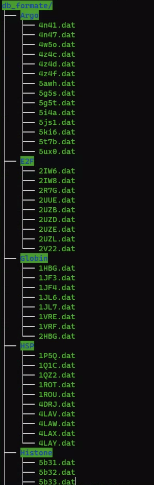

# Portien classfication

## 建置環境
1. `make`
2. `g++ -o PDBformater.o PDBformater.cpp`

## 前處理：
先將所有不同蛋白質的class的pdb檔案，利用PDBformater轉換成.dat檔案以符合FFSM讀入的形式


P1為以FFSM演算法的執行檔，將所有的.dat檔案讀入得到各個子圖的code
再取每個class 最長的code 來代表此class的最大子圖並存於"lcs_all_class_dict"，以python dictionary type儲存。
## 執行（分類）
Input: a.dat
Output: *class name*, *longest common string*

以"workflow.sh"為執行腳本
進到工作目錄(/exp)後使用

1. `cd exp`
2. `./workflow.sh a.dat`

即可得到所屬於的class以及代表最大子圖的code

### 測量單次執行時間
```
$time ./workflow.sh a.dat
```

## 實驗
To be updated.


## 執行說明：
一開始會先將a.dat依同樣的方式取得各個子圖的code存於"subgraph.txt"
在"classify.py"，將前者最長的code和在“lcs_all_class_dict"各個代表class的最長code，利用LCS演算法取得最大的子圖(longest code)和所在的類別


modify with [https://github.com/ChristalC/Frequent-Subgraph-Mining](https://github.com/ChristalC/Frequent-Subgraph-Mining)

[1]: Huan, Jun, Wei Wang, and Jan Prins. "Efficient mining of frequent subgraphs in the presence of isomorphism." Data Mining, 2003. ICDM 2003. Third IEEE International Conference on. IEEE, 2003. ([pdf](http://www.cs.unc.edu/techreports/03-021.pdf))
